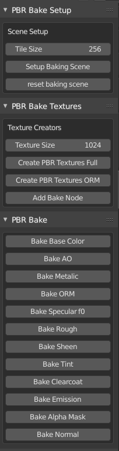
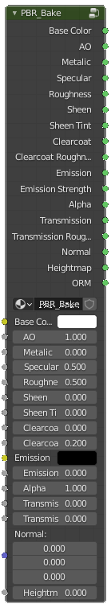
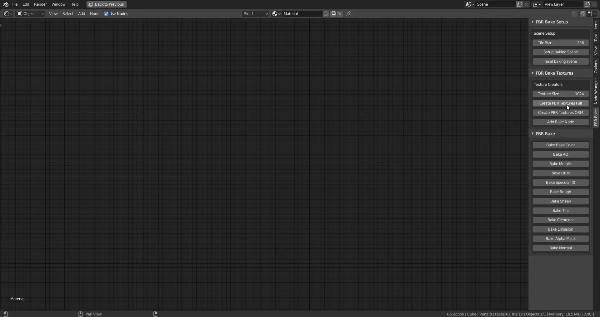
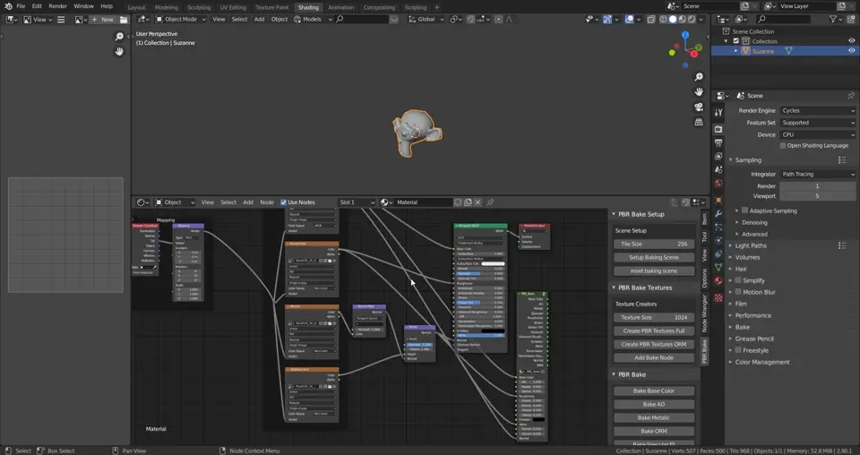

# A Blender addon that aids in the creation of PBR Texture baking

# Features
- Create PBR textures on the fly with one button
- Change scene settings for optimal baking 
- Custom bake node to bake every value you need
- Seperate buttons to bake each value

# Images

# Mini Tutorial

- To start, setup your baking scene under the scene setup tab located in the node editor > pbr bake tab
- Next, choose your texture size and click on either "Create PBR Textures Full" or "Create PBR Textures ORM"
- Next click on the "Add Bake Node" Button, this is crucial because this node makes a lot of it possible
- Connect/copy the textures/values from the Principled shader to the pbr bake group
- Finally select the texture you want to bake in the node editor and click on the corrosponding button in the PBR Bake tab. 
- Continue with all textures until complete

[Full tutorial can be found here](https://github.com/TehMerow/PBR_Bake_Tools/wiki/Tutorial)

# Gotchas

- This isn't a one button solution but it's something I needed to speed up the process quite a bit
- right now this only works with **one material per object** if you need more materials per object I'd recommend masking with vertex colors and have multiple shaders withing the material
- This doesn't cover things like shadow and combined baking but that process is already available in blender as is

The better solution than this would be to use proper texture baking software like armorpaint but my computer can't handle those so this is my solution lol

