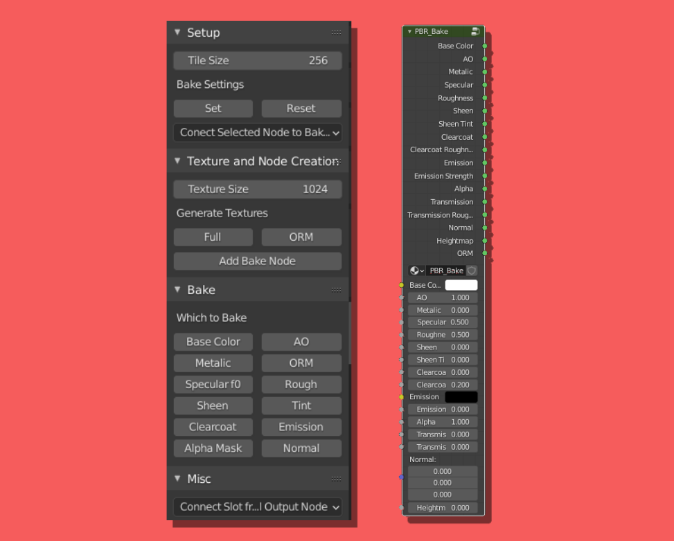
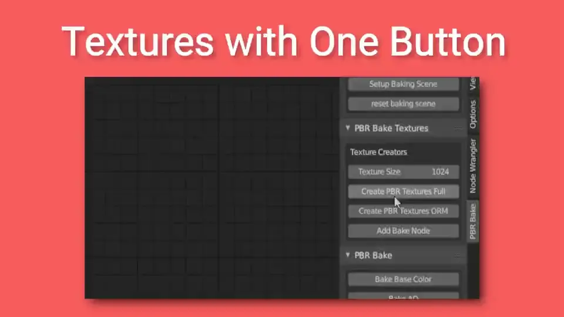
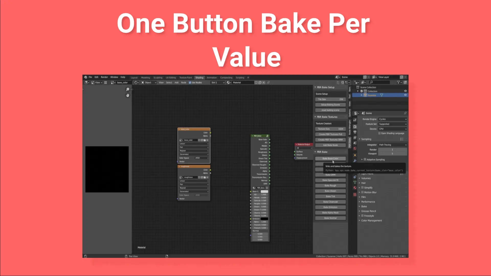
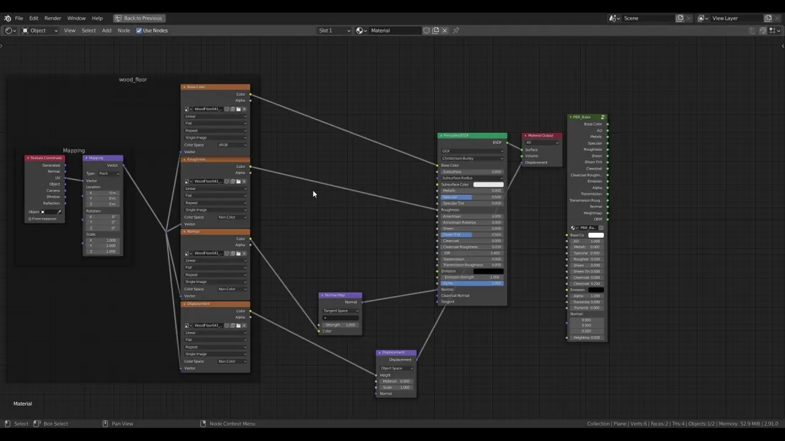
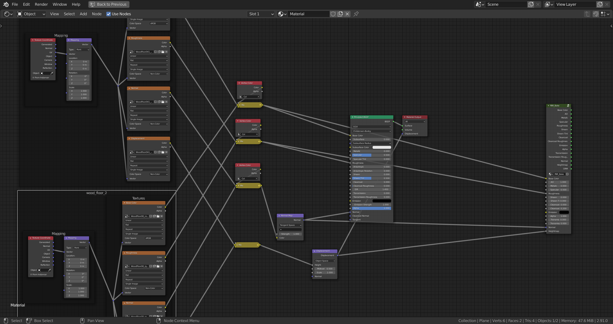

# A Blender Add-On that Aids in the Creation of PBR Texture Baking

A simple solution for speeding up the process of PBR Texture baking

# Features

- Create PBR textures on the fly with one button
- Change scene settings for optimal baking 
- Custom bake node to bake every value you need
- Seperate buttons to bake each value

# Images

## Side Panel and Bake node

The Side panel includes scene setup, texture creation and individual bake buttons

***

The PBR Bake Node has inputs and outputs for most of your PBR needs and will auto connect when you push one of the bake buttons on the sidebar

***

## Add Textures with a Single Button

***

Press a button and get a full PBR texture layout or an ORM texture layout all with their color spaces set appropriately to their texture type

***

## Bake Textures with a Single Button

Individual buttons for each bake pass so you don't have to navigate a drop down menu

---

## Connect Textures to PBR Bake Node with Ease!
***New***

With the hotkey menu you can easily connect the textures your want directly to the PBR Bake node

No More Node Wrangler shenanigans

---

# Mini Tutorial

- To start, setup your baking scene under the scene setup tab located in the node editor > pbr bake tab

- Next, choose your texture size and click on either "Create PBR Textures Full" or "Create PBR Textures ORM"

- Next click on the "Add Bake Node" Button, this is crucial because this node makes a lot of it possible

- Connect/copy the textures/values from the Principled shader to the pbr bake group

- Finally select the texture you want to bake in the node editor and click on the corrosponding button in the PBR Bake tab.

- Continue with all textures until complete

## [Full tutorial can be found here](https://github.com/TehMerow/PBR_Bake_Tools/wiki/Tutorial)

---

# Recommended Add-ons

Where these add-ons are not required for this one to work, they are nice to have for it

[Vertex Color Master](https://github.com/andyp123/blender_vertex_color_master) ➡ Useful for making Vertex Color Masks for multiple textures in a single material

[Node Wrangler *(Blender Built-in add-on)*](https://docs.blender.org/manual/en/latest/addons/node/node_wrangler.html) ➡ Just good to have on  

# Gotchas

- This isn't a one button solution but it's something I needed to speed up the process quite a bit

- right now this only works with **one material per object** if you need more materials per object I'd recommend Vertex color masking with the textures

*Example for using vertex masking to have multiple 'materials' within one node tree*

- This doesn't cover things like shadow and combined baking but that process is already available in Blender as is

